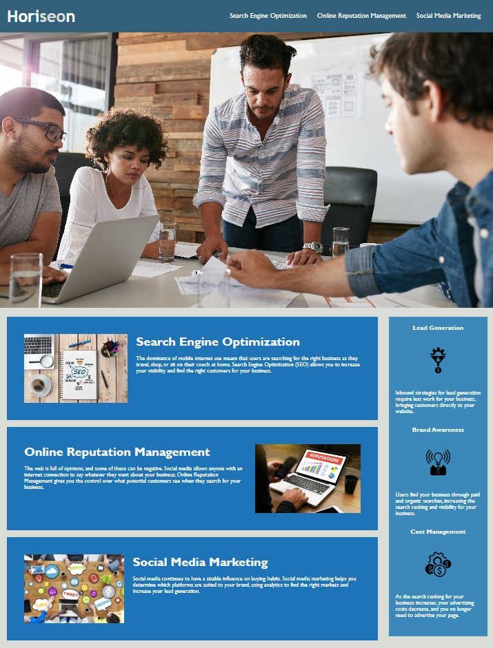

# horiseon-code-refactor

## Description 
The Horiseon Code Refactor Template is a static webpage offered by Horiseon. I aimed to improve my HTML and CSS skills and create a accessible design. The project stands out with its clean layout, semantic HTML, and visually engaging styling.

Enhancements Implemented:

1. **Redundant Classes Consolidated:**
   - Removed redundant classes to streamline the CSS code and improve maintainability.

2. **Semantic HTML Elements:**
   - Replaced generic HTML elements with semantic HTML elements for improved document structure and accessibility.

3. **Alt Text for Images:**
   - Added descriptive alt text to images for better accessibility and user experience.

4. **Explanatory Comments in HTML:**
   - Inserted explanatory comments within the HTML document to provide clarity and context for different sections.

5. **Reorganized CSS Structure:**
   - Restructured the CSS code to follow a logical and organized layout for easier readability and maintenance.

6. **Separation of Classes and Elements:**
   - Separated CSS classes and elements, organizing them alphabetically within each group for a systematic arrangement.

7. **Comments for Code Sections:**
   - Added comments in the CSS file to delineate each section, making it easier to navigate and understand the purpose of specific code blocks.

8. **Descriptive Title Added:**
   - Included a descriptive title in the HTML document to provide clear and concise information about the webpage's content.

## Installation

Upload index.html, license.txt, and assets folder to the deployed webserver. The assets folder contains images and CSS files.

The deployed website linked was deployed using GitHub Pages.
[Link to the deployed website](https://john-991.github.io/horiseon-code-refactor/)

## Usage 

### Running the Project on github
It it not yet optimized for smaller screens.
[html link](starter/index.html)

## Features

Clean and semantic HTML structure.
Visually appealing styling with a cohesive color scheme.
Engaging images to complement the content.

## Credits

Collaborators on this project included instructional staff, TAs, and students in the EDX Boot Camp 2023 cohort. 

## License

Copyright (c) 2023 John-991

Permission is hereby granted, free of charge, to any person obtaining a copy
of this software and associated documentation files (the "Software"), to deal
in the Software without restriction, including without limitation the rights
to use, copy, modify, merge, publish, distribute, sublicense, and/or sell
copies of the Software, and to permit persons to whom the Software is
furnished to do so, subject to the following conditions:

The above copyright notice and this permission notice shall be included in all
copies or substantial portions of the Software.

THE SOFTWARE IS PROVIDED "AS IS", WITHOUT WARRANTY OF ANY KIND, EXPRESS OR
IMPLIED, INCLUDING BUT NOT LIMITED TO THE WARRANTIES OF MERCHANTABILITY,
FITNESS FOR A PARTICULAR PURPOSE AND NONINFRINGEMENT. IN NO EVENT SHALL THE
AUTHORS OR COPYRIGHT HOLDERS BE LIABLE FOR ANY CLAIM, DAMAGES OR OTHER
LIABILITY, WHETHER IN AN ACTION OF CONTRACT, TORT OR OTHERWISE, ARISING FROM,
OUT OF OR IN CONNECTION WITH THE SOFTWARE OR THE USE OR OTHER DEALINGS IN THE
SOFTWARE.
